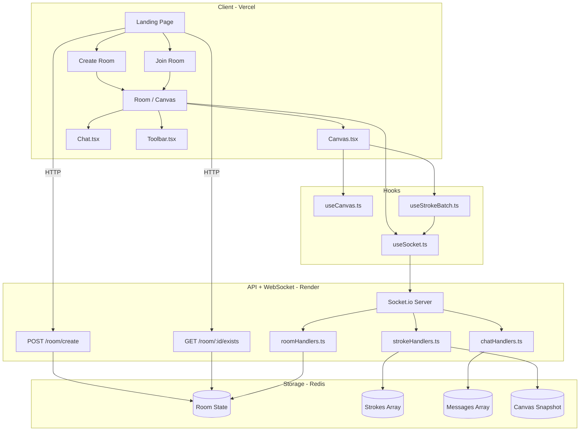

# 🎨 Drawee


> A realtime collaborative whiteboard + chat app. No accounts, no signups — just share a room ID and start drawing together. Ephemeral by design: rooms vanish after 2 hours or when everyone leaves.

[Live Demo](https://drawee-wk3j.vercel.app/)

---

## 🎯 Overview

Drawee is a drop-in collaborative canvas built for friends. Open a room, share the link, and anyone can draw on the same whiteboard in real time — no friction, no auth walls. Built as a deep-dive into WebSocket architecture, Redis-backed ephemeral state, and the surprisingly tricky problem of making a canvas work consistently across mobile and desktop.

### ✨ Why This Project?
- **WebSocket-first thinking**: Not just slapping Socket.io on top of something — actually reasoning about what lives in the client, what lives in Redis, and what gets emitted when
- **Mobile-first canvas**: Pointer Events API, logical coordinate normalization, `touch-action: none` — all the stuff that tutorials skip over and mobile users immediately hit
- **Stateless by design**: No database, no auth, no persistence. Redis is the source of truth. The whole architecture is built around that constraint
- **Collab project**: Built together with a friend — real division of concerns, real handoffs

---

## 🚀 Features

### Core Functionality
- ✅ **Realtime Collaborative Canvas**
  - Multiple users drawing on the same canvas simultaneously
  - Strokes synced via WebSocket — full path emitted on `pointerup`, not per-pixel
  - Logical coordinate space (4096 × 2304) so a stroke on desktop looks identical on mobile

- ✅ **Room System**
  - Create a named room or join by room code — no account needed
  - Max 10 participants per room
  - Rooms auto-destroy after 2 hours via Redis TTL, or immediately when the last person leaves

- ✅ **Erase Without Breaking**
  - No white-paint eraser (breaks on dark-mode mobile — confirmed)
  - `isDeleted` flag toggled on the stroke object instead — canvas redraws from the array via `requestAnimationFrame`, skipping deleted strokes
  - Idempotent: two people erasing the same stroke at the same time = no conflict

- ✅ **New Joiner Catchup**
  - Canvas snapshot (base64) shown instantly while stroke history loads from Redis
  - Once the full strokes array arrives, the snapshot fades and the canvas redraws from source of truth
  - New joiners never see a blank canvas mid-session

- ✅ **Sidebar Chat**
  - Up to 100 messages per room, enforced server-side
  - Messages carry sender name and color — same identity as on the canvas

- ✅ **Compaction**
  - Every 5 minutes, server checks if enough strokes have been erased (threshold: 50)
  - If yes: filter out `isDeleted` strokes, rewrite the clean array to Redis, regenerate canvas snapshot
  - `deletedCount` lives in server memory — lightweight, no extra Redis keys

### Room Lifecycle — Three Layers
- 🔁 **Redis TTL** — 2hr expiry set at room creation. Auto-deletes. Zero code required.
- 🔁 **Disconnect grace period** — on every disconnect, if the room empties, a 30s timer starts. Rejoin = timer cleared. No rejoin = room destroyed.
- 🔁 **Compaction interval** — runs per room, clears dead strokes, refreshes snapshot. Cleared on room destruction.

---

## 🛠️ Tech Stack

### Frontend (Deployed to Vercel)
| Technology | Purpose |
|------------|---------|
| **React + Vite** | Fast dev setup, component-based canvas UI |
| **TypeScript** | Type safety across the whole client |
| **Tailwind CSS** | Utility-first styling |
| **Socket.io-client** | WebSocket connection to the server |

### Backend (Deployed to Render)
| Technology | Purpose |
|------------|---------|
| **Express** | HTTP server — room create/exists API |
| **Socket.io** | WebSocket server, event routing |
| **ioredis** | Redis client — all persistent state lives here |
| **TypeScript** | Same types, same safety, server side |

### Storage & Deploy
| Layer | Choice | Why |
|-------|--------|-----|
| Storage | Redis (server-side only) | Ephemeral, fast, zero-config TTL |
| Frontend | Vercel | Next to zero config for Vite + React |
| Backend | Render (free tier) | Simple enough for demo/portfolio scale |

---

## 🏗️ Architecture



### Data Flow — Stroke Lifecycle

```
pointerdown → pointermove (collect points) → pointerup
→ normalize to logical coords (4096 × 2304) in useStrokeBatch.ts
→ emit "draw-stroke" via Socket.io
→ server saves stroke to Redis
→ server broadcasts to room
→ other clients receive stroke
→ denormalize to screen coords in useCanvas.ts
→ requestAnimationFrame redraws canvas
```

### New Joiner Flow

1. Join event → server fetches full stroke + message history from Redis
2. Canvas snapshot emitted immediately → shown as loading screen
3. Full stroke array arrives → client stores in local elements array
4. Canvas redraws from array → snapshot disappears

---

## 📁 Project Structure

```
drawee/
├── client/                         # Deployed to Vercel
│   ├── src/
│   │   ├── pages/
│   │   │   ├── Landing.tsx         # Create/join room UI
│   │   │   └── Room.tsx            # Main canvas page
│   │   ├── components/
│   │   │   ├── Canvas.tsx          # Canvas rendering
│   │   │   ├── Chat.tsx            # Sidebar chat
│   │   │   ├── Toolbar.tsx         # Drawing tools, color picker
│   │   │   └── Drawer.tsx
│   │   ├── hooks/
│   │   │   ├── useSocket.ts        # Socket.io connection + event listeners
│   │   │   ├── useCanvas.ts        # Draw logic, rAF loop, coord denormalization
│   │   │   └── useStrokeBatch.ts   # Point collection, coord normalization, emit on pointerup
│   │   ├── context/
│   │   │   ├── RoomContext.tsx
│   │   │   └── RoomProvider.tsx
│   │   ├── lib/
│   │   │   └── socket.ts           # Socket.io singleton
│   │   └── main.tsx
│   └── package.json
│
└── server/                         # Deployed to Render
    ├── src/
    │   ├── index.ts                # Express + Socket.io entry point
    │   ├── socket/
    │   │   └── handlers/
    │   │       ├── roomHandlers.ts     # join, leave, destroy
    │   │       ├── strokeHandlers.ts   # draw, erase
    │   │       └── chatHandlers.ts     # messages
    │   ├── redis/
    │   │   ├── client.ts           # ioredis singleton
    │   │   └── roomRepository.ts   # ALL Redis read/write — nothing else touches Redis
    │   ├── services/
    │   │   ├── roomService.ts      # Room lifecycle, TTL, grace period timer
    │   │   └── canvasService.ts    # Snapshot generation, compaction trigger
    │   ├── jobs/
    │   │   └── cleanupJob.ts       # Per-room compaction interval
    │   └── types/
    │       └── index.ts            # Room, Stroke, Player, Message types
    └── package.json
```

### Data Schemas

**Stroke**
```ts
{
  id: string,
  color: string,               // hex
  coordinates: number[][],     // logical space (4096 × 2304)
  isDeleted: boolean           // toggled on erase, never spliced out immediately
}
```

**Room (Redis)**
```ts
{
  uid: string,
  players: { name: string, color: string }[],
  messages: { senderName: string, color: string, text: string, time: Date }[],
  strokes: Stroke[],
  createdAt: Date,
  deletedAt: Date,
  snapshot: string             // base64 canvas screenshot
}
```

---

## 📌 API Routes

| Method | Route | Description | Auth Required |
|--------|-------|-------------|---------------|
| POST | `/room/create` | Create a new room | No |
| GET | `/room/:id/exists` | Check if a room exists before joining | No |

Everything else — drawing, erasing, chatting, joining, leaving — happens over WebSocket events.

---

## 🧩 Challenges Overcome

### 1. Mobile Canvas Input
**Problem:** Separate `mousedown`/`touchstart` handlers are a mess. Strokes would drop mid-draw on mobile when the pointer drifted outside the canvas bounds.

**Solution:**
- Switched entirely to the Pointer Events API — one unified event stream for mouse and touch
- `canvas.setPointerCapture(e.pointerId)` on every `pointerdown` — keeps the stroke alive even if the pointer leaves the canvas
- `touch-action: none` in CSS — stops the browser from swallowing touch events for scrolling before the handler sees them

### 2. Cross-Device Coordinate Consistency
**Problem:** A stroke drawn at `(960, 540)` on a 1920px desktop is a completely different position on a 390px phone. Sharing raw screen coordinates breaks everything.

**Solution:**
- Fixed logical canvas space: 4096 × 2304
- Normalize on capture in `useStrokeBatch.ts`: `logicalX = (e.clientX / canvas.width) * 4096`
- Denormalize on render in `useCanvas.ts`: `physicalX = (coord[0] / 4096) * canvas.width`
- Redis stores logical coords — nothing upstream ever changes regardless of the device

### 3. Erase on Dark Mode
**Problem:** White-paint eraser looks fine on a white canvas. On dark mode mobile browsers, it leaves white smears. Not fixable with paint.

**Solution:**
- Scrapped the paint eraser entirely
- `isDeleted: true` flag on the stroke object instead
- Canvas redraws from the elements array on every `requestAnimationFrame`, skipping flagged strokes
- Idempotent by nature — two simultaneous erases of the same stroke don't conflict

### 4. New Joiner Cold Canvas
**Problem:** New joiners who join mid-session see a blank canvas for however long it takes to fetch and redraw all historical strokes. Jarring.

**Solution:**
- Canvas snapshot (base64) stored in Redis and updated by the compaction interval
- Server emits the snapshot to new joiners immediately — they see the canvas as it was
- Stroke history loads in the background; once ready, canvas redraws from source of truth and snapshot disappears
- Not pixel-perfect for the last few strokes since the snapshot — but good enough that it doesn't feel broken

### 5. Redis Growing Unboundedly
**Problem:** Erased strokes with `isDeleted: true` never go away. Over time, the strokes array in Redis keeps growing even if the visible canvas is mostly empty.

**Solution:**
- `deletedCount` tracked in server memory (JS object, not Redis) per room — incremented on every erase event
- Every 5 minutes, if `deletedCount > 50`: fetch strokes, filter out `isDeleted` ones, rewrite the clean array, regenerate snapshot, reset counter
- Only runs when it's worth it — skips rooms with minimal erasing

---

## 🔮 Potential Improvements

### Short-Term
- [ ] Display participant list with names and assigned colors
- [ ] Stroke undo (Ctrl+Z) for your own last stroke
- [ ] Brush size selector in the toolbar
- [ ] Loading skeleton while stroke history arrives

### Medium-Term
- [ ] Zoom + pan — architecture already supports it (logical coord system means zoom is just a `scale + translate` on the canvas context at render time)
- [ ] Cursor presence — show where each participant's pointer is in real time

### Long-Term
- [ ] AI describes your drawing — send `canvas.toDataURL()` to a vision model; snapshot architecture already makes this trivial
- [ ] Past room archive — on room end, copy snapshot + metadata to a DB for the creator
- [ ] Stroke simplification via Ramer-Douglas-Peucker if arrays get too large

---

## 🎓 What I Learned

### Technical Skills
- **WebSocket Architecture**: Thinking clearly about what state lives where — client memory vs Redis vs emitted events — and why that separation matters when users join mid-session
- **Canvas APIs**: `requestAnimationFrame` loops, coordinate math, `setPointerCapture`, why `touch-action: none` exists and what happens without it
- **Redis as Ephemeral State**: Using TTL as a feature, not a workaround. Designing around the fact that Redis will just delete things
- **Realtime Conflict Handling**: Idempotent erase operations, optimistic UI, and why "last write wins" is actually fine for most cases here

### Architecture Thinking
- **Dual Storage Pattern**: Client-side array for fast rendering, Redis for persistence and catchup — keeping them in sync via WebSocket events rather than polling
- **Designing for Constraints**: Free tier Render, no database, no auth. Every architectural decision was shaped by what we weren't going to use
- **Stroke as a Unit**: Emitting the full path on `pointerup` instead of streaming points on `pointermove` — one decision that simplified everything downstream (Redis writes, socket payloads, erase logic)

### Collaboration
- **Shared Architecture Docs**: Both contributors working from the same mental model of the system before writing a line of code
- **Handoff-Friendly Code**: Keeping Redis access behind a single `roomRepository.ts`, keeping coordinate math in two specific hooks — so either person can work on any feature without needing to understand everything

---

## 📧 Contact

**Built by Rishita Talukdar**

- GitHub: [@Ayush Maiti](https://github.com/Sedow360)
- Project Repository: [Drawee](https://github.com/Sedow360/drawee)

For questions, bug reports, or suggestions — open an issue.

---

## 📄 License

This project is open source and available under the [MIT License](LICENSE).

---

*"No accounts. No history. No proof you were ever there. Just draw."*